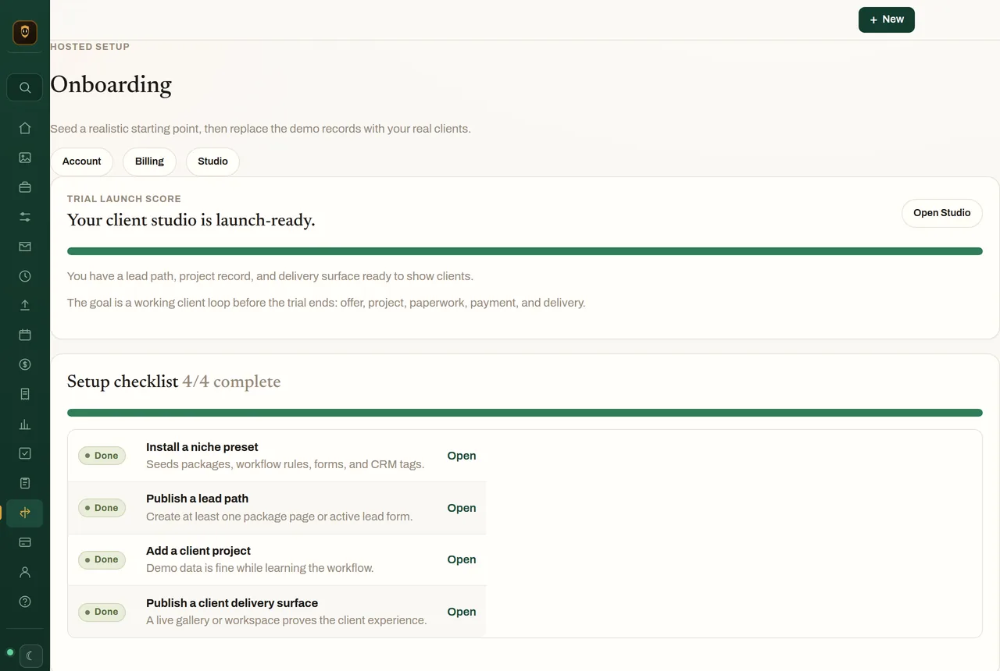
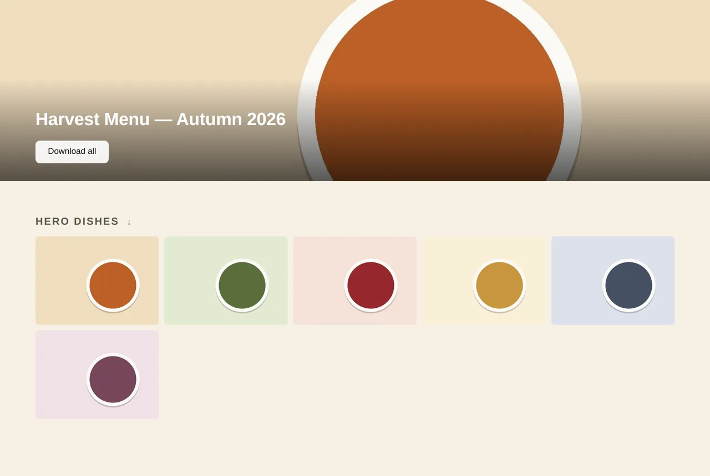
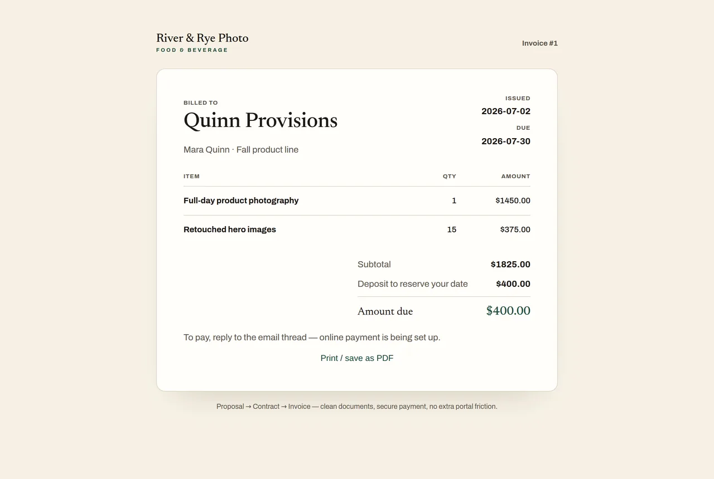

# Mise

[](https://github.com/Ayyitskevin/mise/actions/workflows/ci.yml)
[](https://github.com/Ayyitskevin/mise/actions/workflows/ios.yml)
[](LICENSE)


Mise is an open-source product-incubation sandbox for a solo photography studio:
a FastAPI + HTMX web application, an isolated hosted-SaaS mode, and a native
SwiftUI companion. The implemented web product brings CRM, galleries, booking,
client paperwork, payments, and workflow reminders into one deliberately small
system.

> **Project status:** exploratory and pre-release. This repository is not deployed
> and has no live users. The iOS app is a capable companion, not yet the complete
> “pocket studio OS” described by the long-term product direction. Launch and App
> Store claims remain held until the open correctness, policy, and product-scope
> issues are resolved.

## What exists today

| Surface | Current reality |
| --- | --- |
| Web studio | Implemented modular monolith with CRM, galleries, proposals, contracts, invoices, booking, automation, and public client surfaces. |
| Self-hosted mode | Default runtime: one studio, one SQLite database, local media, optional integrations. |
| Hosted mode | Implemented tenant routing, per-studio SQLite/media isolation, trials, Stripe subscription state, operator tooling, and lifecycle jobs; not deployed. |
| iOS | Native owner/client companion with tenant discovery, scoped auth, read-heavy studio views, gallery/client flows, and a narrow set of guarded commands. It is not full web parity. |
| AI features | Optional sidecar-backed capabilities, dormant unless explicitly configured, with human-review requirements at the adapter boundary. |
| Distribution | No public service, TestFlight release, or App Store submission. The launch tracker records the current holds. |

The hosted concept is one flat **$20/month** plan with no feature tiers. That is a
product hypothesis in this sandbox, not a currently available commercial offer.

## Review Mise safely in ten minutes

The reviewer launcher exposes the public product tour using a disposable temporary
data directory. It ignores every inherited `MISE_*` variable, loads no local
`.env`, binds only to loopback, and deletes its state when stopped.

```bash
python -m venv .venv
.venv/bin/pip install -r requirements.txt -r requirements-dev.txt
.venv/bin/python scripts/reviewer_demo.py
```

Open [http://localhost:8400/demo](http://localhost:8400/demo), then visit
`/pricing` and `/healthz`. Press `Ctrl+C` to stop and remove the temporary state.

This is a static, unauthenticated product tour. It does **not** create a tenant,
exercise Stripe, contact external services, or provision App Review credentials.
Do not run `scripts/seed_demo_tenant.py`; [issue #185](https://github.com/Ayyitskevin/mise/issues/185)
documents why that separate hosted-state provisioner is held.

| Onboarding | Gallery | Invoice |
| --- | --- | --- |
|  |  |  |

For a structured code tour and review prompts, use the
[reviewer guide](docs/REVIEWER-GUIDE.md).

## Architecture at a glance

Mise is a modular monolith with two explicit delivery boundaries:

- browser routes use signed, tenant-bound cookies and server-rendered HTMX;
- `/api/v1` uses scoped opaque sessions for the native app and never reuses the
  browser or machine-token boundary.

Hosted requests resolve the tenant from the host before entering a tenant runtime.
Each studio receives its own SQLite database and media root; the platform control
database stores tenant, domain, and subscription metadata. Optional AI/media
workers sit behind narrow HTTP adapters and remain disabled without configuration.

See [Architecture](docs/ARCHITECTURE.md), the
[iOS architecture](docs/IOS-ARCHITECTURE.md), the
[mobile API contract](docs/IOS-API-V1.md), and the 70 checked-in
[architecture decisions](docs/adr/).

## Run the self-hosted web app

```bash
pip install -r requirements.txt
cp .env.example .env
# Set MISE_SECRET_KEY and MISE_ADMIN_PASSWORD in .env.
python -m uvicorn app.main:app --port 8400
```

Open `http://localhost:8400/admin/login`. Self-hosted mode is the default and uses
one SQLite database under `MISE_DATA_DIR`. Optional Stripe, email, calendar,
Notion, and AI sidecars stay dormant until their environment variables are set.

For a containerized local deployment, use `docker compose up --build`. The hosted
deployment design is documented in [docs/SAAS-DEPLOYMENT.md](docs/SAAS-DEPLOYMENT.md),
but its launch checklist is intentionally not a claim that a service is live.

## Development

Python 3.12 is the supported runtime. The repository gates deliberately partition
the complete Python suite:

```bash
source .venv/bin/activate
python -m pytest tests/ -m unit
MISE_DATA_DIR=$(mktemp -d) MISE_SECRET_KEY=test MISE_ADMIN_PASSWORD=pw \
  MISE_ENV_FILE=/nonexistent python -m pytest tests/ -m "not unit"
ruff check .
ruff format --check .
```

The non-unit partition needs `ffmpeg` for video-pipeline coverage. iOS changes run
through the macOS `build-test` workflow; local setup is in [ios/README.md](ios/README.md).

## Repository map

| Path | Purpose |
| --- | --- |
| `app/` | FastAPI composition, domain modules, hosted tenancy, jobs, API boundaries |
| `app/admin/` | Owner/operator HTML routes |
| `app/public/` | Client galleries, portals, documents, payments, booking, marketing |
| `ios/` | SwiftUI application, repositories, networking, session security, tests |
| `migrations/` | Forward and rollback SQL history for tenant databases |
| `templates/`, `static/` | Server-rendered interface and committed review assets |
| `tests/` | Unit, contract, authorization, tenancy, billing, and end-to-end coverage |
| `docs/adr/` | Architecture decision record history |
| `docs/` | Canonical architecture, security, launch, operations, and historical reviews |

## Engineering constraints worth reviewing

- Tenant choice comes from the request host, never a caller-supplied tenant ID.
- Existing tenant storage opens fail-loud and can never become an empty replacement studio.
- Money webhooks are signature-verified, replay-guarded, and amount-reconciled.
- Native retryable commands use idempotency keys and explicit workflow state.
- Secrets and optional integrations fail dormant rather than open.
- AI adapters require human review and do not persist directly.
- Schema, money, auth, legal, and deploy changes are human-gated by
  [AGENTS.md](AGENTS.md).

The [security policy](SECURITY.md) explains private reporting; the operational
[security playbook](docs/SECURITY.md) documents the implemented model.

## Known holds

Mise keeps unresolved risk visible rather than presenting a green CI badge as
launch approval. The most material open decisions and defects are tracked in:

- [#182 — native companion versus pocket studio OS scope](https://github.com/Ayyitskevin/mise/issues/182)
- [#180 — App Store purchase/IAP strategy](https://github.com/Ayyitskevin/mise/issues/180)
- [#179 — privacy manifest and label accuracy](https://github.com/Ayyitskevin/mise/issues/179)
- [#185 — safe reviewer-account replacement](https://github.com/Ayyitskevin/mise/issues/185)

The issue tracker contains narrower native correctness work beneath those holds.

## Contributing and AI transparency

Start with [CONTRIBUTING.md](CONTRIBUTING.md). This repository is openly
AI-assisted; [docs/AI-DEVELOPMENT.md](docs/AI-DEVELOPMENT.md) describes the
authorship, evidence, disclosure, privacy, and human-approval standard used for
agent contributions.

## License

Mise is licensed under the
[GNU Affero General Public License v3.0 only](LICENSE) (`AGPL-3.0-only`). Network
operators who modify Mise are responsible for the corresponding-source obligations
in the license, including section 13.
