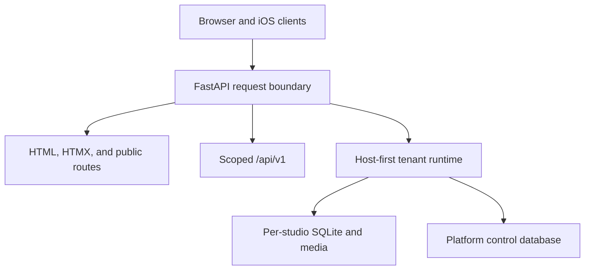

# Mise architecture

This document is the reviewer-facing map of the implemented system. The ADRs hold
durable design decisions; this page explains how those decisions fit together in
the current tree.

## System shape

Mise is a modular monolith with a native client. One FastAPI process serves the
browser application, hosted control plane, public client surfaces, service API,
and `/api/v1`. Domain code is organized by capability rather than by a generic
controller/service/repository stack.

The self-hosted default bypasses hosted tenant resolution and uses one SQLite
database plus one media tree. Hosted mode adds a root/control host and resolves a
studio from the request host before domain handlers execute.

## Runtime boundaries

| Boundary | Authority | State | Primary code |
| --- | --- | --- | --- |
| Browser owner/admin | Signed cookie bound to the current credential and tenant context | Tenant DB and media | `app/admin/`, `app/security.py`, `app/saas.py` |
| Public client links | Narrow gallery/portal/workspace/document capability | Tenant DB and media | `app/public/` |
| Native app | Opaque, rotating, scoped bearer sessions | Tenant DB, API session/replay tables | `app/mobile_api.py`, `app/mobile_auth.py`, `app/mobile_*_api.py`, `ios/` |
| Hosted control plane | Root-host operator session | Control DB: tenant identity, domain, subscription/lifecycle metadata | `app/saas.py` |
| Machine/service API | Explicit service bearer token | Narrow job or media operation | `app/service_api.py` |
| Optional AI/media sidecars | One configured outbound adapter/token per capability | Result persistence remains in Mise | `app/providers/`, capability adapters |

These identities are intentionally not interchangeable. The native API does not
reuse browser cookies or global machine tokens, and a client capability does not
become a general client account.

## Tenant isolation

Hosted isolation is instance-per-tenant at the application-data layer:

1. The outer tenant middleware reads the request host.
2. Platform/root paths stay in the control context; a tenant subdomain resolves to
   one immutable tenant record.
3. A tenant runtime swaps the database and media roots through request-local
   context variables.
4. Domain queries run against that tenant's SQLite database rather than filtering
   shared rows by a caller-supplied tenant ID.
5. Signed cookies and native sessions bind the immutable tenant identity so they
   cannot replay across studios.

Custom domains are verified into the same host-first path. Tenant IDs, slugs, or
headers supplied by the client never select a database.

New-tenant provisioning is the only boundary that creates a tenant tree or
database. Every retained-tenant request, job, sweep, and export opens the database
in SQLite `mode=rw` before use; a process-cache miss may migrate that positively
opened database but cannot create directories. Missing or unreadable storage
returns a correlated `503 tenant.storage_unavailable`, emits an unconditional
non-secret log signal plus a throttled ops alert when configured, and leaves
healthy tenants running.

## Data and migrations

- `migrations/` is the ordered tenant-schema history; matching rollback files live
  under `migrations/rollback/`.
- Hosted control schema migration lives separately in the SaaS module.
- Dates that follow the studio's business day use the repository's injected studio
  clock rather than the machine date.
- Money is stored as integer cents. Payment transitions are reconciled against
  expected amounts and external event IDs.
- Consequential native commands use idempotency receipts or durable workflow state
  instead of assuming an HTTP timeout means failure.

Schema, billing, auth, legal, and deploy changes are human-gated in `AGENTS.md`.

## Web delivery

The browser product is server-rendered with Jinja and HTMX. Templates are grouped
into admin, public/client, SaaS, and studio-site surfaces. A shared middleware stack
applies tenant context, CSRF, rate limiting, request correlation for `/api/v1`, and
security headers. Middleware registration order is documented in `app/main.py`
because Starlette executes the last registered middleware outermost.

The web product is the broadest implemented surface. It contains the complete
studio workflow that the native companion is gradually exposing.

## Native delivery

The SwiftUI application uses feature-oriented MVVM, repository protocols, an
actor-isolated API client, Keychain-backed rotating sessions, and tenant-namespaced
cache keys. The backend advertises available commands; the app does not infer
authority from a screen or app version.

Current native scope is deliberately described as a companion. Read-heavy owner
and client journeys plus a few guarded commands are implemented, but first-studio
creation and full CRM/project/commercial/gallery operation remain incomplete.
[#182](https://github.com/Ayyitskevin/mise/issues/182) owns that product truth.
See `IOS-ARCHITECTURE.md` and `IOS-API-V1.md` for the detailed contract.

## AI capability boundary

AI features are optional and fail dormant. The provider registry distinguishes
production-capable, evaluation-only, and decommissioned adapters. Adapters return a
human-review requirement and do not write business state directly; the calling
domain owns validation and persistence.

Current adapters primarily call separately operated sidecars. They are not part of
the default Docker stack and no live model/API call occurs in the test suite. The
architecture and development-authorship policies are separate; see
`AI-DEVELOPMENT.md` for the latter.

## Verification strategy

The Python suite is split into exhaustive partitions rather than a small “smoke”
filename convention:

- `-m unit`: hermetic logic, contracts, authorization, and fast hosted tests;
- `-m "not unit"`: the remaining end-to-end suite against disposable databases,
  including the video pipeline;
- Ruff lint and formatting;
- a separate macOS workflow for generated Xcode project build and XCTest.

Security, tenancy, billing, and API behavior are exercised through focused
regressions in addition to broad end-to-end journeys. A green gate demonstrates
the checked behavior; it does not clear the documented launch holds.

## Code map for reviewers

| Question | Start here |
| --- | --- |
| How is the app composed? | `app/main.py` |
| How is configuration armed or kept dormant? | `app/config.py`, `.env.example` |
| How does tenant resolution work? | `app/saas.py`, `tests/test_saas.py` |
| How are browser sessions secured? | `app/security.py`, `app/admin/auth.py`, `docs/SECURITY.md` |
| How does native auth rotate and revoke? | `app/mobile_auth.py`, `ios/Mise/Core/Security/` |
| How are retryable native writes handled? | `app/mobile_idempotency.py`, `app/booking_workflow.py` |
| How does payment truth move? | `app/public/pay.py`, payment ADRs, focused payment tests |
| Why was a design chosen? | `docs/adr/README.md` and the numbered ADRs |

## Explicit non-claims

- Mise is not deployed and has no live users.
- The hosted mode is implemented but not launch-approved.
- The iOS app is not yet the full studio operating system described by the product
  direction.
- A static `/demo` tour is not a durable App Review account.
- A green CI run is not evidence that App Store, billing, privacy, backup, signing,
  or production operations have been rehearsed.
