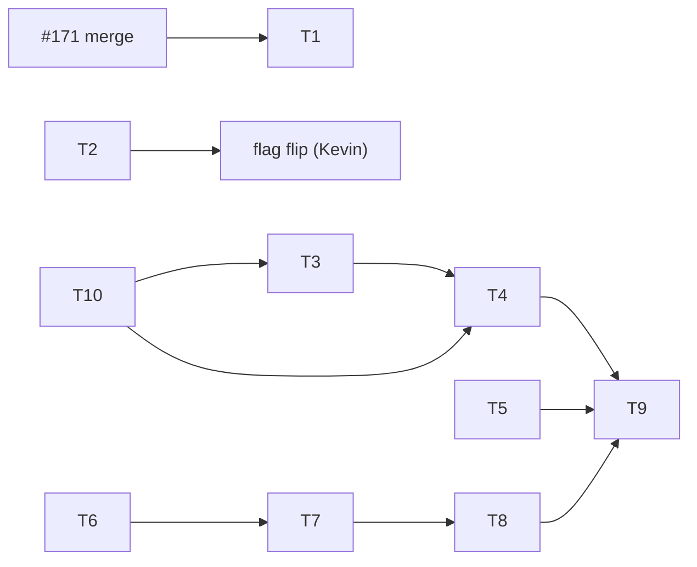

# Conductor plan — work orders to ship Mise as a micro-SaaS

**Date:** 2026-07-17 (evening) · **Conductor:** the coordinating model session, on
Kevin's instruction · **Executors:** Opus (judgment lane), Sonnet (mechanical lane),
Kevin (human-only lane) · **Strategy layer:** `docs/APP-STORE-GAMEPLAN.md` (phases,
audit evidence) and ADR 0070 (distribution decision) — this document is the
**operational layer**: ticket-by-ticket instructions an executor can pick up cold.

How to use this doc: pick the lowest-numbered ticket in your lane whose
preconditions are met, do exactly one ticket per branch/PR, satisfy its acceptance
criteria, run its verification, and update the board table. Do not batch tickets.

## 1. Mission review (the conductor's read)

**What Mise is.** A solo photography studio's entire back office in one deployable
unit: CRM pipeline → proposal → contract → invoice/payments → gallery proofing →
booking/scheduling, plus a client-facing portal. Two audiences, one spine: the
**studio owner** (admin + owner iOS app) and the **studio's clients** (web portal +
client iOS experience via the four guest capabilities). AI features are drafts a
human approves (§11.4), never autonomous.

**How it makes money** (ADR 0047, unchanged): hosted instance-per-customer at a
flat **$20/month per studio**, Stripe-billed on the web, self-host free. The iOS
app is **free** and sells nothing (ADR 0070) — it is the acquisition hook and the
daily-use surface that makes the subscription sticky.

**Definition of launch** (from the game plan, still the bar): a stranger finds the
marketing site, starts a trial, gets their studio subdomain, downloads the Mise
app, signs into their studio, runs their business from it — and Stripe charges
them $20/month until they cancel. No human operator in the loop.

**One identity question the fleet must stop straddling.** The original docs and
the commercial spine speak **F&B/commercial** (companies, AR chase, closeout);
the repo description and AGENTS.md now say **wedding photographers**. The product
spine is genuinely niche-agnostic, so code is unaffected — but the App Store
listing, marketing site, and demo studio each need ONE story. Conductor's
recommendation: **wedding-first** for the public listing (larger addressable
market, matches the repo's stated direction, the warm boutique design language
already fits), with the commercial spine positioned as "for studios that also
shoot commercial." Ticket T10 packages this as a decision for Kevin; nothing else
blocks on it except final store copy and demo-studio seed content.

**Where we actually are.** The hard engineering is done and green: multi-tenant
`/api/v1` with tenant-bound sessions, the complete revenue path (trial → Stripe →
dunning → cancel/export/delete), the owner + client iOS apps with the native
command surface, the packaging layer (icon, privacy manifest, account deletion,
submission pack), and the funnel links end-to-end. Launch is blocked on **ops and
human decisions, not code** — accounts, a deploy, signing identity, a demo studio,
and store copy.

## 2. Process rules (from the 2026-07-17 red-main incident — binding)

Main's iOS gate was red across three consecutive commits (`d08c7bd` → `d628d44` →
`b2522b7`), cured by `1a45430`. Root cause: a byte-exact wire-contract test whose
encoder expectation drifted, pushed **straight to main where the iOS gate cannot
be pre-verified** (no agent has local Xcode). Every open `ios/**` PR inherited the
failure, which read as "everything is failing." Rules to prevent recurrence:

- **R-iOS-1.** iOS changes are NEVER pushed straight to `main`, even when
  green-light by AGENTS.md category. They always go through a PR so the
  `build-test` gate runs pre-merge. (Python-only green-light work may still go
  straight to main — the full gate runs locally there.)
- **R-iOS-2.** Rebase an `ios/**` branch onto current `main` immediately before
  push, and again whenever `main` moves before merge. A stale base plus a
  wire-contract test is exactly how phantom failures appear in merge previews.
- **R-iOS-3.** Byte-exact wire assertions must state WHY the bytes look that way
  (e.g. Foundation escapes `/` as `\/`). If an encoder policy changes, the same
  PR updates every byte-exact test and says so.
- **R-iOS-4.** First-responder rule: whichever agent session first observes a red
  `main` diagnoses it before starting new feature work — read the failing job
  log, identify the commit, and either fix forward (small, obvious) or flag for
  human revert. Never build atop a red main.
- **R-PR-1.** One ticket = one branch = one PR, using the repo template
  (What/Why/Verified/Rollback/Risk). A PR that needs a sibling PR merged first
  says so in its opening line.
- **R-PR-2. Claim a ticket before starting it** (from the 2026-07-17 T1 collision:
  two agents built the 402 screen in parallel — `claude/t1-billing-402` and
  `codex/ios-subscription-required` — wasting a CI run and forcing #173 closed for
  #174). **The claim is an OPEN, ticket-tagged draft PR** — not a branch. A branch
  alone can't hold a claim: a closed PR's branch lingers on the remote (e.g.
  `claude/t1-billing-402` outlived #173), and `ls-remote` exposes no push time, so
  "first branch wins" is neither releasable nor observable. PR state is: it opens,
  closes/merges, and carries a queryable `created_at`.
  1. **Pre-flight.** Before writing code for `Tn`, list **open** PRs and look for
     one whose title starts `Tn — …` or whose head branch matches `*/t<n>-*`. If an
     open one exists, the ticket is taken — pick another. Closed or merged PRs do
     **not** hold a claim (that is how a claim is released). A stale remote branch
     with no open PR is only a hint, never a claim.
  2. **Stake it.** Branch `<agent>/t<n>-<slug>` (e.g. `claude/t3-demo-studio`) **and**
     PR title prefixed `Tn — 
`; open the draft PR early (even WIP) so the
     claim is visible. The branch is the discovery hint; the open PR is authoritative.
  3. **Earliest open PR wins — unless the conductor reassigns.** *Default:* if two
     open PRs target `Tn`, the earlier GitHub `created_at` holds it and the later
     closes in its favor, porting good ideas via review comment. *Exception:* when the
     earliest claim doesn't cover the ticket's full acceptance surface, the conductor
     may reassign `Tn` to a more complete PR — recording the reason on the superseded
     PR and closing it, so ownership stays singular and observable. Either way exactly
     one open PR ends up owning the ticket; don't race to merge. (T1 went the exception
     route: #173 was earlier but only handled Home's 402; #174 covered every
     `ResourceView`, so #173 was closed with the reason recorded and #174 became
     authoritative — keeping #173's sticky-retry idea.)
  4. **Board updates happen at merge, in your ticket's own row** (§3) — never on a
     feature branch pre-merge (invisible on `main` until then) and never on another
     ticket's row. This PR touches only §2 for exactly that reason.

## 3. Board (as of 2026-07-17 evening)

| Item | State |
|---|---|
| Native reschedule recovery (#165), game plan + ADR 0070 (#166), packaging layer (#167), funnel fields (#169), hosted happy-path test (#170), app funnel links (#171), reschedule hardening (#168) | ✅ merged |
| Red main (3 commits) | ✅ cured at `1a45430`; postmortem rules above |
| `MISE_BOOKING_WORKFLOW_ENABLED` | ⛔ stays `false` until T2 |
| T1 — 402 "manage billing" screen | ✅ implemented; iOS PR `build-test` remains the merge gate |
| Tickets T2–T10 below | ⬜ open |

## 4. Work orders

### T1 — 402 "manage billing" screen [Sonnet · 🟢 · precondition: #171 merged]

The app decodes `manageBillingURL` (from `GET /api/v1/tenant`) but doesn't surface
it when a studio's subscription lapses.

Steps:
1. Find where the owner session surfaces API failures (the `ResourceView` error
   path and the `tenant.subscription_required` problem already modeled in
   `APIProblem`). Add a dedicated full-screen state for HTTP 402 with copy like
   "Your studio's subscription needs attention", a "Manage billing" `Link` to the
   workspace's `manageBillingURL` (fall back to `StudioAccountLinks` billing URL
   when the descriptor field is nil), and a "Try again" retry button.
2. Do NOT sign the user out on 402 — the session is valid; the subscription isn't.
3. Tests: XCTest that a stubbed 402 problem routes to the new state and that the
   link URL prefers descriptor `manageBillingURL` over the fallback; snapshot of
   the state is optional.

Acceptance: fresh 402 from any owner read shows the screen with a working
link-out; recovery (200 after retry) returns to normal content.
Verification: iOS CI `build-test` green (per R-iOS-1, via PR).
Rollback: revert the PR — additive UI state only.

### T2 — Durable-workflow activation review [Opus lead, Kevin approves · 🔴]

The gate holding native reschedule's side effects (`MISE_BOOKING_WORKFLOW_ENABLED`,
migration 083). Three linked reviews plus two held #164 security questions:
1. Effects/outbox correctness: read `app/booking_workflow.py` + migration 083;
   prove each effect kind dispatches exactly once across worker restart. Write the
   e2e test: enqueue a reschedule, simulate a crash between lease and completion,
   restart the worker loop, assert single delivery (lease expiry → retry, no dupe).
2. Client calendar delivery: verify CANCEL/REQUEST ICS use the persisted
   `calendar_uid` so client calendars update the same event rather than duplicating.
3. Security holds from #164: (a) prove token refresh preserves the backend session
   ID that scopes idempotency replays (SessionAuthenticator + `api_sessions`);
   (b) resolve the sign-out vs late-cache-write race (codex PR #168 claims this —
   review it as part of T2 rather than duplicating).
Deliverable: an ADR ("booking-workflow activation") recording the three findings
+ the flag-flip procedure + rollback (flip back; effects table is inert when off).
The flag itself flips only by Kevin after the ADR merges.

### T3 — Reviewer demo studio [Sonnet build · 🟢 code, 🔴 if it touches signup gates]

Gap G6: App Review needs a working studio without an invite code or expiring trial.
Steps:
1. New `scripts/seed_demo_tenant.py` (hosted mode): creates tenant slug `demo-tour`
   with fixed reviewer credentials from env (never committed), seeds showcase data
   by reusing `app/saas_demo.py` seeding + `bootstrap.ensure_public_showcase`
   patterns (galleries, a project with proposal/contract/invoice, bookings, tasks).
2. Add an operator-console path (not public web) to mark a tenant `demo` so the
   trial sweep skips it (a `tenants.demo` flag is a control-DB migration → 🔴 PR).
3. Document credentials workflow in `docs/APP-STORE-SUBMISSION.md` §Reviewer access.
Acceptance: fresh run against a staging host yields a signable-in studio with
populated screens on the app; trial never lapses on it.
Verification: hosted pytest covering the seed script; manual sign-in from TestFlight.

### T4 — Store metadata + screenshots pack [Sonnet draft, Kevin approves · 🟢]

Complete `docs/APP-STORE-SUBMISSION.md`: app name/subtitle candidates, promotional
text, description, keywords, support/marketing URLs (hosted `/support`, marketing
root), screenshot shot-list (6.7" + 6.1": owner dashboard, pipeline, gallery
proofing, invoice, client portal, booking) with the demo studio (T3) as the
subject. Store copy follows the T10 niche decision. Acceptance: a copy-paste-ready
Connect worksheet; no unresolved placeholders except signing identity.

### T5 — Guideline verification pass [Opus · 🟢 · submission week only]

Re-verify against the CURRENT App Store Review Guidelines (cite text + date):
3.1.3(a/b) reader/multiplatform rules for the web-subscription model with zero
in-app purchase affordance; 5.1.1(v) account deletion; 2.1 demo access; privacy
labels vs `PrivacyInfo.xcprivacy`. Deliverable: findings appended to the
submission doc; any conflict becomes its own ticket before submission.

### T6 — Signing identity + release config [Kevin · human-only]

`ios/project.yml`: real `DEVELOPMENT_TEAM`, final bundle id (product-brand, per
ADR 0070), version/build bump. `ios/Config/Release.xcconfig`: replace the
`https://mise.example` placeholder platform root with the real marketing host.
Then archive per `docs/APP-STORE-SUBMISSION.md` §Archive (Mac required).

### T7 — Staging deploy + launch playbook [Kevin + Opus assist · 🔴 deploy]

`docs/LAUNCH-PLAYBOOK.md` stages 3.1–5 in order: accounts (domain, VPS, Stripe
live, B2, Telegram) → compose deploy with wildcard TLS (`docs/SAAS-DEPLOYMENT.md`,
ADR 0059) → `.env` fill → **money rehearsal** (real card, trial → charge → cancel
→ refund) → backup + restore drill → counsel skim of `/terms` `/privacy`.
Acceptance: the playbook's own checklist is green end-to-end; `/api/v1/tenant`
answers on a tenant subdomain over TLS (ATS-clean) and the TestFlight build signs
into it.

### T8 — TestFlight beta [Kevin · human-only · after T6+T7]

Internal testers → external beta against staging; collect crashes/feedback ≥1 week
or until quiet; file fixes as tickets.

### T9 — Submission [Kevin · after T3–T8]

Submit with T3 reviewer credentials in the notes and T4 metadata. Any rejection
becomes a ticket with the reviewer's text quoted verbatim.

### T10 — Niche story decision [Opus prepares, Kevin decides · 🟢 docs]

One page: wedding-first vs F&B-first vs neutral "solo photography studios" for
the store listing + marketing site + demo content, with the conductor's
wedding-first recommendation and what each choice changes (copy, screenshots,
demo seed). Kevin picks; T3/T4 consume the answer.

## 5. Sequencing

T1, T2, T10 are startable now (T1 the moment #171 merges). T3–T5 are pre-submission
work that needs no deploy. T6–T9 are the human runway. Nothing here requires the
booking-workflow flag; native reschedule ships dormant and activates after T2.

## 6. Definition of done — v1.0 on the App Store

Every board row ✅ · main green ≥1 week under fleet activity · money rehearsal
passed on staging · app approved and listed · first real trial signup can reach a
working studio from the app with no operator intervention.
